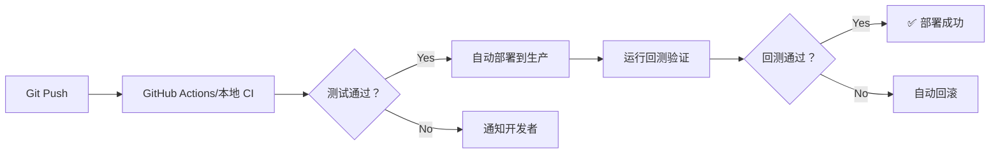

# DevOps #8：量化系统 DevOps 化实战

> 2026-05-17
> 前置：安全实践 #7

## 1. 当前量化系统的 DevOps 评估

```
当前状态：
  ✅ Git 管理代码
  ✅ D 盘自动备份日志和配置
  ✅ 飞书告警通知
  ⚠️ 无自动化测试
  ⚠️ 手动部署
  ❌ 无 CI/CD
  ❌ 无容器化
  ❌ 无自动回滚机制

目标是：
  从"手动管理"到"脚本化部署"再到"自动化 Pipeline"
  分阶段推进，不一步到位
```

## 2. Phase 1：基础脚本化

### 2.1 一键部署脚本

```powershell
# deploy_pipeline.ps1 — 一键部署量化系统
param(
    [ValidateSet("development","production")]
    [string]$Env = "development"
)

Write-Host "╔══════════════════════════════════════╗" -ForegroundColor Cyan
Write-Host "║  量化系统一键部署 Pipeline            ║" -ForegroundColor Cyan
Write-Host "╚══════════════════════════════════════╝" -ForegroundColor Cyan

# === 1. 代码更新 ===
Write-Host "`n📦 [1/5] 更新代码..." -ForegroundColor Yellow
git pull origin main
if ($LASTEXITCODE -ne 0) {
    Write-Host "❌ Git pull 失败" -ForegroundColor Red
    exit 1
}

# === 2. 依赖安装 ===
Write-Host "`n🐍 [2/5] 安装依赖..." -ForegroundColor Yellow
pip install -r requirements.txt --quiet
pip install -r requirements-dev.txt --quiet  # 测试工具

# === 3. 测试 ===
Write-Host "`n🧪 [3/5] 运行测试..." -ForegroundColor Yellow
$env:PYTHONPATH = "."
python -m pytest tests/unit/ -v --tb=short --junit-xml=test-report.xml
if ($LASTEXITCODE -ne 0) {
    Write-Host "❌ 单元测试失败" -ForegroundColor Red
    exit 1
}

# === 4. 回测验证 ===
Write-Host "`n📊 [4/5] 回测验证..." -ForegroundColor Yellow
python scripts/backtest_smoke.py --days 500
if ($LASTEXITCODE -ne 0) {
    Write-Host "❌ 回测验证失败" -ForegroundColor Red
    exit 1
}

# === 5. 重启服务 ===
Write-Host "`n🚀 [5/5] 重启服务..." -ForegroundColor Yellow
# 停止旧进程
Get-Process -Name "python" -ErrorAction SilentlyContinue | 
    Where-Object { $_.CommandLine -match "monitor" } | 
    Stop-Process -Force

# 启动新进程
$logFile = "logs/monitor_$(Get-Date -Format 'yyyyMMdd_HHmmss').log"
Start-Process python -ArgumentList "src/monitor.py" `
    -RedirectStandardOutput $logFile

Write-Host "`n✅ 部署完成！" -ForegroundColor Green
Write-Host "   环境: $Env"
Write-Host "   日志: $logFile"
```

### 2.2 健康检查脚本

```powershell
# healthcheck.ps1 — 系统健康检查
param([string]$Service = "all")

function Check-Monitor {
    Write-Host "`n📊 监控服务检查" -ForegroundColor Yellow
    
    $proc = Get-Process -Name "python" -ErrorAction SilentlyContinue |
        Where-Object { $_.CommandLine -match "monitor" }
    
    if (-not $proc) {
        Write-Host "  ❌ 监控进程未运行" -ForegroundColor Red
        return $false
    }
    
    $uptime = (Get-Date) - $proc.StartTime
    Write-Host "  ✅ 运行中 (PID: $($proc.Id), 已运行: $($uptime.ToString('hh\:mm\:ss')))" -ForegroundColor Green
    return $true
}

function Check-Disk {
    $drive = Get-PSDrive -Name D
    $pctFree = ($drive.Free / $drive.Used * 100)
    Write-Host "  💾 D 盘: 剩余 $($pctFree.ToString('F1'))% ($([math]::Round($drive.Free/1GB, 2)) GB)"
    
    if ($pctFree -lt 10) {
        Write-Host "  ❌ 磁盘空间不足！" -ForegroundColor Red
        return $false
    }
    return $true
}

Write-Host "╔══════════════════════╗" -ForegroundColor Cyan
Write-Host "║  量化系统健康检查     ║" -ForegroundColor Cyan
Write-Host "╚══════════════════════╝" -ForegroundColor Cyan

$allGood = $true
if ($Service -eq "all" -or $Service -eq "monitor") {
    $allGood = (Check-Monitor) -and $allGood
}
if ($Service -eq "all" -or $Service -eq "disk") {
    $allGood = (Check-Disk) -and $allGood
}

if ($allGood) {
    Write-Host "`n✅ 所有检查通过" -ForegroundColor Green
} else {
    Write-Host "`n❌ 存在需要关注的问题" -ForegroundColor Red
}
```

## 3. Phase 2：CI/CD 集成



### 3.1 本地 CI（Windows 批处理）

```yaml
# .github/workflows/quant-ci.yml — 量化 CI
name: Quant CI

on:
  push:
    branches: [main, dev]
    paths:
      - 'src/**'
      - 'strategies/**'
      - 'scripts/**'
      - 'tests/**'
      - 'requirements.txt'

jobs:
  test:
    runs-on: ubuntu-latest
    steps:
      - uses: actions/checkout@v4
      
      - name: Setup Python
        uses: actions/setup-python@v5
        with:
          python-version: '3.11'
      
      - name: Install deps
        run: pip install -r requirements.txt -r requirements-dev.txt
      
      - name: Lint
        run: ruff check src/ tests/
      
      - name: Test
        run: pytest tests/unit/ -v --cov=src --cov-report=term
      
      - name: Backtest smoke
        run: python scripts/backtest_smoke.py --days 200
```

### 3.2 部署后的自动健康检查

```python
# scripts/post_deploy_check.py
import requests
import sys

def check_deployment():
    checks = []
    
    # 1. 服务在运行（检查飞书消息——如果配置了）
    # 2. 进程存在
    import psutil
    for proc in psutil.process_iter(['pid', 'name', 'cmdline']):
        if any('monitor' in str(cmd).lower() 
               for cmd in proc.info['cmdline'] or []):
            checks.append(('monitor 运行中', True))
            break
    else:
        checks.append(('monitor 运行中', False))
    
    # 3. 能获取行情
    try:
        from src.api import TencentStockAPI
        api = TencentStockAPI()
        quote = api.get_quote("sz000009")
        checks.append(('行情 API 可用', quote is not None))
    except Exception:
        checks.append(('行情 API 可用', False))
    
    # 报告
    all_pass = all(v for _, v in checks)
    for name, passed in checks:
        icon = "✅" if passed else "❌"
        print(f"  {icon} {name}")
    
    return all_pass

if __name__ == "__main__":
    if not check_deployment():
        print("❌ 部署后检查失败")
        sys.exit(1)
    print("✅ 部署后检查全部通过")
```

## 4. Phase 3：容器化监控

### 4.1 Dockerfile

```dockerfile
# Dockerfile.quant — 量化引擎容器
FROM python:3.11-slim AS builder

RUN apt-get update && apt-get install -y \
    gcc g++ && rm -rf /var/lib/apt/lists/*

WORKDIR /app
COPY requirements.txt .
RUN pip install --no-cache-dir -r requirements.txt

FROM python:3.11-slim
WORKDIR /app

COPY --from=builder /usr/local/lib/python3.11/site-packages /usr/local/lib/python3.11/site-packages
COPY src/ ./src/
COPY strategies/ ./strategies/
COPY config/ ./config/

RUN useradd -m quant && chown -R quant:quant /app
USER quant

HEALTHCHECK --interval=30s --timeout=10s --retries=3 \
    CMD python -c "from src.health import check; exit(0 if check() else 1)"

ENTRYPOINT ["python", "src/monitor.py"]
```

### 4.2 docker-compose.yml

```yaml
version: '3.8'

services:
  quant-monitor:
    build:
      context: .
      dockerfile: Dockerfile.quant
    container_name: quant-monitor
    restart: unless-stopped
    volumes:
      - ./logs:/app/logs
      - ./data:/app/data
    env_file:
      - .env
    environment:
      - TZ=Asia/Shanghai
    logging:
      driver: "json-file"
      options:
        max-size: "10m"
        max-file: "3"
    deploy:
      resources:
        limits:
          memory: 2g
          cpus: '2'
```

## 5. 量化系统专属的 DevOps 实践

### 5.1 策略版本管理

```
每次策略变更都应有记录：
  变更了什么参数
  回测结果（夏普、年化等）
  生效时间

存储方案（D 盘）：
  D:\kai_knowledge\core\deploy_history.json
```

```python
# scripts/deploy_history.py
import json
from datetime import datetime
from pathlib import Path

HISTORY_FILE = Path("D:/kai_knowledge/core/deploy_history.json")

def record_deployment(strategy: str = "all", metrics: dict = None):
    record = {
        "timestamp": datetime.now().isoformat(),
        "version": get_git_version(),
        "strategy": strategy,
        "user": "ci-pipeline",
        "status": "success",
        "metrics": metrics or {}
    }
    
    history = []
    if HISTORY_FILE.exists():
        history = json.loads(HISTORY_FILE.read_text())
    
    history.append(record)
    
    # 只保留最近 100 条
    HISTORY_FILE.write_text(json.dumps(history[-100:], indent=2, ensure_ascii=False))

def get_git_version():
    import subprocess
    result = subprocess.run(
        ['git', 'describe', '--tags', '--always'],
        capture_output=True, text=True
    )
    return result.stdout.strip() or "unknown"
```

### 5.2 自动止损+回滚

```python
# scripts/auto_rollback.py — 实盘表现监控 + 自动回滚
import json
import subprocess
import time
from pathlib import Path

MONITOR_DATA = Path("data/performance.json")
THRESHOLD_SHARPE = -0.5  # 夏普低于这个值触发回滚

def check_and_rollback():
    if not MONITOR_DATA.exists():
        return
    
    with open(MONITOR_DATA) as f:
        performance = json.load(f)
    
    for strategy, metrics in performance.items():
        sharpe = metrics.get("sharpe_ratio", 0)
        if sharpe < THRESHOLD_SHARPE:
            print(f"🚨 策略 {strategy} 夏普 {sharpe:.2f} 低于阈值，触发回滚")
            
            # 自动回滚
            subprocess.run(["git", "revert", "HEAD", "--no-edit"])
            subprocess.run(["git", "push", "origin", "main"])
            
            # 重启
            subprocess.run(["python", "src/monitor.py"])
            print(f"✅ 已回滚到上一版本")
            return True
    return False
```

## 6. DevOps 实施路线

```
Phase 1（当前 → 1 周内）：
  ✅ 部署脚本（deploy_pipeline.ps1）
  ✅ 健康检查（healthcheck.ps1）
  ✅ CI Pipeline（GitHub Actions）
  → 从手动部署 → 脚本化部署

Phase 2（1-3 月内）：
  ⬜ 容器化（Dockerfile + docker-compose）
  ⬜ 自动回滚（auto_rollback.py）
  ⬜ 测试覆盖率目标：80%+
  → 从脚本化部署 → 自动化 CI/CD

Phase 3（3-6 月内）：
  ⬜ 分布式参数搜索（K8s Job）
  ⬜ 监控面板（Prometheus + Grafana）
  ⬜ 灰度发布
  → 从单机容器化 → 分布式部署
```

## 总结

```
量化系统 DevOps 化的核心价值：
  1. 部署可重复（脚本化 → 容器化）
  2. 变更可追溯（Git + 部署历史）
  3. 问题可回滚（自动止损机制）
  4. 状态可监控（健康检查 + 告警）

8 课 DevOps 收官。
  从 CI/CD 到 Docker 到 K8s
  从监控到日志到 IaC 到安全
  最后一节直接量化系统落地
```
