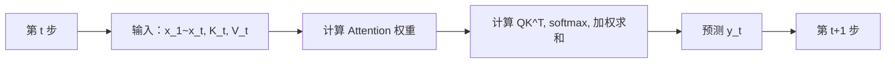
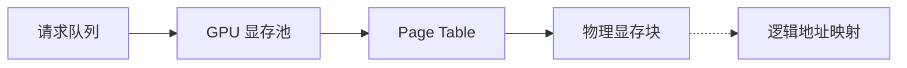
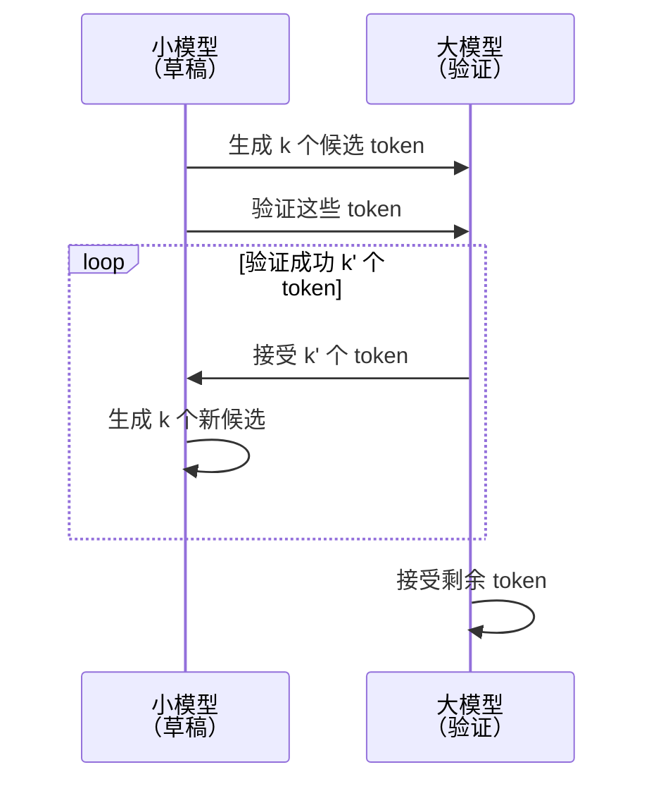

# LLM 推理基础与 KV Cache

> 目标读者：已经理解 Transformer 架构基本原理（Self-Attention、FFN、LayerNorm）的 AI 工程师
> 版本：v1.0 | 日期：2024

---

## 1. 自回归解码回顾

### 1.1 训练 vs 推理的计算差异

在**训练阶段**，Transformer 的输入序列长度固定，所有 token 并行处理：
```
输入：x_1, x_2, ..., x_T
输出：h_1, h_2, ..., h_T （所有位置同时计算）
```

在**推理阶段**（自回归解码），目标是逐个生成 token：
```
第 t 步输入：x_1, ..., x_t （已生成的 token）+ 已缓存的 h_1, ..., h_t
第 t 步输出：预测下一个 token y_t
```

**关键问题**：在推理时，如果每次重新计算所有 Key/Value，显存占用会随序列长度线性增长 —— 这就是 KV Cache 存在的根本原因。

### 1.2 自回归生成的步骤



**推理瓶颈**：每生成一个 token，需要重新计算所有已有位置的 Q、K、V 矩阵。这导致：
- 计算量随序列长度线性增长
- 显存带宽压力巨大

---

## 2. KV Cache 原理

### 2.1 为什么需要 KV Cache？

**核心思想**：已经计算过的 Key 和 Value 矩阵可以缓存起来，下次使用时直接复用，避免重复计算。

在 Self-Attention 公式中：
```
Attention(Q, K, V) = softmax(QK^T / √d) × V
```

第 t 步生成时，需要的 Key/Value 是序列 `x_1, ..., x_{t-1}` 的 K 和 V 矩阵：
```
K_t = [K_1, K_2, ..., K_{t-1}]   ← 这些已经缓存！
V_t = [V_1, V_2, ..., V_{t-1}]
```

### 2.2 增量更新流程

假设我们有一层 Self-Attention 模块：

**第 t-1 步**（生成 x_{t-1}）：
```python
# 输入
x_{t-1}  # 新的 token

# 计算 Q、K、V
q_{t-1} = W_Q @ x_{t-1}   # shape: [head_dim]
k_{t-1} = W_K @ x_{t-1}   # shape: [head_dim]
v_{t-1} = W_V @ x_{t-1}   # shape: [head_dim]

# 缓存更新
K = [K_{t-2}, K_{t-1}]     # 拼接新的 K
V = [V_{t-2}, V_{t-1}]     # 拼接新的 V
```

**第 t 步**（生成 x_t）：
```python
# 不需要重新计算 K_{t-1}, V_{t-1}
q_t = W_Q @ x_t
k_t = W_K @ x_t
v_t = W_V @ x_t

# 使用缓存计算注意力
K_cache = [K_{t-1}, k_t]    # 包含之前的 K + 新的 K
V_cache = [V_{t-1}, v_t]

Attention_t = softmax(q_t @ K_cache^T / √d) @ V_cache
```

### 2.3 数据结构定义

完整的 KV Cache 结构（多层模型）：

```python
# 单个 Attention Head 的缓存
K_cache.shape = (seq_len, batch_size, head_dim)  # KV 键矩阵
V_cache.shape = (seq_len, batch_size, head_dim)  # KV 值矩阵

# 完整模型（所有层和 head）
K_all.shape = (num_layers, num_heads, batch_size, seq_len, head_dim)
V_all.shape = (num_layers, num_heads, batch_size, seq_len, head_dim)

# 通常优化为：
K_all.shape = (num_layers × num_heads, batch_size, seq_len, head_dim)
```

**显存优势**：
- 训练时：一次计算所有 token 的 KV，存储
- 推理时：按需查询，每次只新生成一个 token 的 KV

---

## 3. KV Cache 的内存问题

### 3.1 显存占用公式

假设一个 Transformer 模型的参数：
- `num_layers`: 总层数（例如 60 层）
- `num_heads`: 头的数量（例如 40 个）
- `head_dim`: 注意力头维度（例如 128）
- `seq_len`: 序列长度（例如 4096）
- `precision`: 精度（FP16 = 2 bytes, BF16 = 2 bytes, FP32 = 4 bytes）

**单个 head 的 KV Cache 显存**（两层矩阵）：
```
KV_显存 = 2 × seq_len × batch_size × head_dim × precision
```

**整个模型的显存**（所有层和所有 head）：
```
Total = num_layers × num_heads × 2 × seq_len × batch_size × head_dim × precision

简化（合并 num_heads × head_dim = head_size）：
Total = 2 × num_layers × batch_size × seq_len × head_size × precision
```

**具体数值示例**（Llama-3-70B 规格近似）：
```
假设：
- num_layers = 80
- num_heads = 80
- head_dim = 128
- batch_size = 1
- seq_len = 8192
- precision = 2 bytes (FP16)

Total = 2 × 80 × 80 × 8192 × 128 × 2 bytes
      = 2 × 80 × 80 × 8192 × 128 × 2
      ≈ 330 MB （单层单序列）
      
乘以层数和 batch：
Total ≈ 80 × 330 MB × 1
      ≈ 26 GB
```

### 3.2 为什么这是瓶颈？

| 问题 | 说明 |
|------|------|
| **线性增长** | 序列长度每翻倍，KV Cache 显存翻倍 |
| **无法压缩** | KV Cache 已经是稠密矩阵，压缩增益有限 |
| **GPU 显存受限** | A100 80GB 显存，长上下文下 KV Cache 可占 30-50% |
| **共享困难** | 不同 batch 的序列不能合并缓存（需 padding） |

**推理延迟分解**：
```
Decode 延迟 = Prefill 延迟 + 逐 token 延迟
             = (输入 token 数 × 并行计算) + (1 × 逐 token)
```

逐 token 阶段的延迟中，KV Cache 的显存访问带宽是主要部分。

---

## 4. PageAttention / vLLM 的核心思想

### 4.1 核心动机：解决显存碎片

**问题场景**：
- 不同请求的序列长度不同
- 固定大小的内存块无法高效利用
- 显存碎片导致无法分配大显存块

**解决方案**：借鉴操作系统虚拟内存的分页机制。

### 4.2 分页数据结构



**页面大小**：
- 典型：256 - 512 个 token 每页
- 可配置：根据显存块大小和序列长度选择

### 4.3 核心算法流程

**步骤 1：内存分配**
```python
# 新请求到来
request = Request(seq_len=512)

# 检查显存池是否有空闲页
pages = pool.allocate(seq_len)

# 如果不够，触发页面交换（swap）
if not enough_space:
    swap_out_olds()
    pages = pool.allocate(seq_len)
```

**步骤 2：增量更新**
```python
# 新 token 到达时
# 分配新 token 的页（如果需要）
if seq_len % page_size != 0:
    pages.add_new_page()

# 只在对应页面上更新 KV，无需移动数据
k_new = W_K @ x_new
v_new = W_V @ x_new
kv_page.update(page_idx, k_new, v_new)
```

**步骤 3：Block 管理**
```python
# Block 状态
BLOCK_STATE:
    1. FREE        - 空闲页
    2. ACTIVE      - 活跃页（有请求在使用）
    3. SWAPPED     - 已交换到 CPU 内存
    4. EVICTABLE   - 可丢弃页（优先级最低）

# vLLM 的 block 调度（类 PageFault 策略）
def select_block_to_swap(num_gpu_blocks_needed):
    # 优先选择：
    # 1. 活跃时间最久的块
    # 2. 被最少请求共享的块
    # 3. 序列最短的块
    return swap_out(block)
```

### 4.4 共享 Prefix 问题

**场景**：多个请求共享历史上下文，但传统方式无法复用。

```python
# 传统做法
Req1: [History, History, New]
Req2: [History, History, New]
→ 两份冗余的 KV Cache

# PageAttention 做法
共享的历史部分只存一份
Req1 和 Req2 共享相同的物理块
→ 显存高效利用
```

### 4.5 vLLM 核心优势

1. **显存利用率高**：接近最优打包（类似 Bin Packing）
2. **Prefill 加速**：预填充时并行计算所有 token
3. **Block 调度**：智能选择交换哪些块
4. **PagedAttention**：原子操作，支持并发解码

---

## 5. Prefill vs Decode 阶段

### 5.1 阶段对比

| 特征 | Prefill | Decode |
|------|---------|--------|
| **计算模式** | 并行计算所有输入 token | 串行（或微批次并行）生成 token |
| **计算量** | 输入序列长度 × 模型参数 | 1 token × 模型参数（逐层） |
| **显存压力** | 中等（一次性加载） | 高（维持完整 KV Cache） |
| **GPU 利用率** | 高（并行计算） | 相对较低（显存访问密集） |
| **优化目标** | 最小化预填充延迟 | 最小化吞吐量（tokens/s） |

### 5.2 Prefill 阶段优化

**并行优势**：
```python
# Prefill 可以并行处理整个输入序列
# 输入：prompt_tokens = [x_1, x_2, ..., x_T]
# 输出：KV 缓存（一次性计算）

# 优势：GPU 计算单元充分利用
batch_prefill = model(prompt, max_seq_len)
```

**优化方向**：
1. **量化**：FP8 或 INT4 量化减少计算
2. **FlashAttention**：减少 HBM 访问
3. **RoPE 缓存**：位置编码预处理
4. **模型剪枝**：移除冗余层

### 5.3 Decode 阶段优化

**逐 token 挑战**：
```python
# Decode stage（逐 token）
for t in range(num_output_steps):
    # 1. 加载 KV Cache（可能 swap in）
    k_cache, v_cache = load_kv(t)
    
    # 2. 计算新的 Q
    q = model.q_proj(new_token)
    
    # 3. 注意力计算
    attn = softmax(q @ k_cache^T / √d) @ v_cache
    
    # 4. 更新缓存
    kv_cache[t+1] = new_kv
    
    # CPU-GPU 通信成为瓶颈
```

**优化方向**：
1. **PagedAttention**：减少 swap 开销
2. **Continuous Batching**：多个请求合并计算
3. **Tensor Parallelism**：多卡并行
4. **Speculative Decoding**：用小模型加速

---

## 6. Speculative Decoding（可选）简介

### 6.1 核心思想

**问题**：大模型（目标模型）推理慢，小模型（草稿模型）快。

**方案**：用小模型快速预测多个 token，然后让大模型验证，避免重复计算。

### 6.2 工作流程



### 6.3 算法伪代码

```python
def speculative_decode(target_model, draft_model, x):
    # 1. 使用草稿模型生成 k 个 token
    draft_tokens = draft_model(x)   # shape: [k]
    
    # 2. 大模型并行验证这些 token
    logits = target_model(input=x, k_drafts=draft_tokens)
    
    # 3. 接受概率（根据分布采样）
    accepted = []
    for i in range(k):
        if 接受(draft_tokens[i], logits[i]):
            accepted.append(draft_tokens[i])
    
    # 4. 返回接受结果
    return accepted + [final_token]
```

### 6.4 加速比

假设：
- 草稿模型生成 k 个 token（耗时 t_draft）
- 验证 k 个 token（耗时 t_verify ≈ t_large）
- 传统做法生成 1 个 token（耗时 t_large）

**理想加速比**：
```
加速比 ≈ 1 + (k - 1) / 接受率

如果接受率 = 0.9, k = 4:
加速比 ≈ 1 + 3 / 0.9 ≈ 4.3 倍
```

### 6.5 实际挑战

1. **接受率**：受模型质量影响
2. **串行执行**：草稿和验证必须按顺序进行
3. **显存管理**：草稿模型的 KV Cache 也需要存储

---

## 总结：推理优化全景图

### 关键概念对比

```
推理延迟分解:
Delay = Prefill_Delay + Decode_Delay
      = (并行优化) + (KV Cache 交换 + 逐 token 计算)

优化重点:
- Prefill: 并行利用率提升
- Decode: 减少 swap 延迟
```

### 技术总结

| 技术 | 解决的问题 | 核心思想 |
|------|----------|---------|
| **KV Cache** | 避免重复计算 K、V | 缓存中间结果 |
| **PageAttention** | 显存碎片化 | 分页管理 + 交换调度 |
| **Prefill 优化** | 输入处理慢 | 并行计算 |
| **Decode 优化** | 吞吐低 | 批量处理 + 交换 |
| **Speculative Decoding** | 速度瓶颈 | 小模型加速草稿 |

### 未来方向

1. **量化感知解码**：FP8/INT4 加速
2. **MoE 混合专家推理**：路由优化
3. **分布式推理**：多卡/多机协同
4. **自适应 batch 大小**：根据显存动态调整

---

## 参考资源

1. **vLLM 官方**：https://vllm.ai/
2. **PagedAttention 论文**：https://arxiv.org/abs/2305.07996
3. **Speculative Decoding 论文**：https://arxiv.org/abs/2211.17192
4. **FlashAttention**：https://arxiv.org/abs/2205.14135
