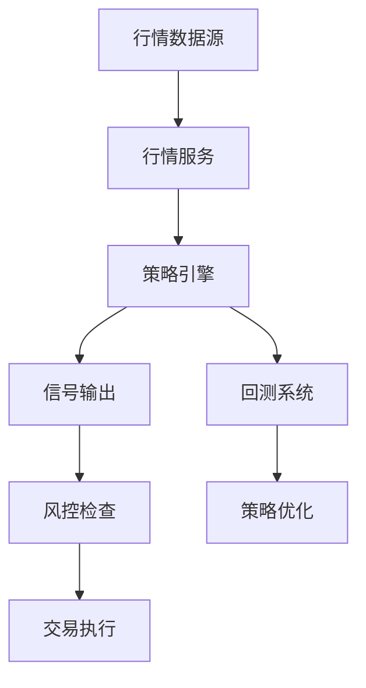

# 第10课：设计与文档

> 系统设计/架构 — Phase 4 波次2
> 日期：2026-05-11

## 1. 系统设计面试核心模式

### 经典题目分类

| 类别 | 典型题目 | 核心考点 |
|------|---------|---------|
| 存储 | 设计短链接系统、分布式KV存储 | ID生成、分片、缓存 |
| 计算 | 设计Top K系统、排行榜 | 堆、精确计数 vs 近似 |
| 通信 | 设计聊天系统、消息推送 | 长连接、离线消息、顺序 |
| 推荐 | 设计新闻推荐、视频推荐 | 召回→排序→重排 |
| 限流 | 设计限流器、API网关 | 令牌桶/漏斗、分布式限流 |
| 唯一ID | 设计分布式ID生成器 | Snowflake、号段模式 |

### 4S 解题框架

```
Scenario（场景）     → 功能需求 + 非功能需求（QPS/延迟/可用性）
Service（服务拆分）  → 拆成哪些微服务，接口定义
Storage（存储设计）  → 选型（SQL/NoSQL/对象存储），Schema
Scale（扩展）       → 瓶颈分析 + 优化方案 + 分级扩展
```

### 估算技巧

```
QPS估算：1亿DAU × 每人每天10次 = 10亿 QPS/天
        10亿 / 86400 ≈ 11,574 QPS（平均）
        峰值 = 均值的3~5倍 ≈ 50,000 QPS

存储估算：每条记录≈1KB，日增1亿条
        每天≈100GB，年≈36TB

带宽估算：每个响应≈10KB，50,000 QPS
        带宽≈ 50,000 × 10KB × 8 = 4Gbps
```

### 常见陷阱

- **过度设计**：一上来就上微服务+K8s，其实单机能撑到百万QPS
- **忽略瓶颈**：只写了优雅的架构，没分析哪里先扛不住
- **没有Trade-off**：只说选了什么，不说为什么选这个而不是那个
- **数字没算**：没说QPS多少、数据量多大、需要多少台机器

## 2. 架构文档: ADR（Architecture Decision Record）

### ADR 格式

每个重要架构决策写一个 ADR，存档在 docs/adr/ 目录。

```markdown
# ADR-001: 量化引擎选择gRPC而非REST

## 状态
✅ 已采纳

## 上下文
现有 system_bridge.py 基于 Python 单进程消息总线，
需要支持跨机器部署和水平扩展。
行情推送场景需要低延迟（<10ms）和高吞吐（>10000 msg/s）。

## 决策
选择 gRPC + Protocol Buffers

## 理由
- HTTP/2 多路复用，适合行情流式推送（而非轮询）
- Protobuf 二进制编码比 JSON 节省约 60% 带宽
- 强类型接口定义，代码生成减少序列化/反序列化错误
- 内置流式支持（Server Streaming / Bidirectional Streaming）
- gRPC Python 生态成熟，与我们现有 Python 技术栈兼容

## 结果
- ✅ 正：性能提升 3-5x、跨语言支持（C++执行服务可用）、接口文档自动生成
- ❌ 负：调试工具不如 REST 丰富（grpcurl 可用但不如 Postman）、浏览器不支持原生 gRPC
- ⚠️ 风险：团队需要学习 proto 语法和 gRPC 调用模式
```

```markdown
# ADR-002: 大乐透数据源选择500.com作为回退

## 状态
✅ 已采纳（2026-05-11）

## 上下文
sporttery.cn API 存在 Cloudflare 防护，fetcher.py 在高频请求时被拦截。
predict_v2.py 需要稳定的大乐透历史数据。

## 决策
主用 sporttery API，回退到 500.com 数据源

## 理由
- 500.com 无反爬，直接 HTTP GET 即可获取
- 数据格式简单（HTML table 正则解析）
- 无需 Cookie/Header 预热
- 但只返回当年数据（26001起），历史深度有限

## 结果
- ✅ 正：预测算法数据源稳定，不再被 Cloudflare 拦截
- ❌ 负：数据只有当年期号，缺少多年历史
- ⚠️ 注意：跨年时 start/end 参数需调整到更大范围（25000-26200）
```

## 3. C4 架构模型

### 四层结构

```
Level 1: Context（系统上下文）
  ┌────────────┐     ┌──────────────┐     ┌──────────┐
  │  外部API    │ ←─→ │   量化系统    │ ←─→ │  用户(羽) │
  │ (交易所)    │     │              │     │          │
  └────────────┘     └──────┬───────┘     └──────────┘
                            │
                     ┌──────┴───────┐
                     │  知识库(D盘)  │
                     └──────────────┘

Level 2: Container（容器/服务拆分）
  ┌──────────┐  ┌──────────┐  ┌──────────┐
  │  策略引擎  │  │  行情服务  │  │  回测系统  │
  └──────────┘  └──────────┘  └──────────┘
  ┌──────────┐  ┌──────────┐  ┌──────────┐
  │ 学习系统  │  │ 知识蒸馏  │  │  好奇心   │
  └──────────┘  └──────────┘  └──────────┘

Level 3: Component（组件级）
  strategy_v4.py 内部：
  ┌───────────────────────────┐
  │   策略引擎                 │
  │  ├─ MA策略模块            │
  │  ├─ 布林带模块            │
  │  ├─ RSI/KDJ模块           │
  │  └─ 融合策略引擎           │
  └───────────────────────────┘

Level 4: Code（代码级，用UML类图）
```

### Mermaid 画图示例



## 4. 技术文档体系

### README 标准结构

```markdown
# 项目名

## 简介（一句话说明）
## 架构图（C4 Level 1）
## 快速开始
  - 环境要求
  - 安装步骤
  - 运行示例
## 使用说明
  - 核心功能
  - 配置文件
  - 常见操作
## 项目结构
  src/  tests/  config/  docs/
## 贡献指南（多人协作时）
## License
```

### API 文档

- **REST**：OpenAPI/Swagger（YAML/JSON定义，自动生成交互式文档）
- **gRPC**：proto 文件本身就是文档 + grpc reflection 服务端反射查询
- **内部接口**：可直接用 Python 的 docstring + Sphinx/readthedocs

### Runbook（应急操作手册）

```
# 量化系统 Runbook

## 场景1：策略引擎无信号输出
1. 检查策略进程是否运行：ps aux | grep strategy_v4
2. 检查行情数据流：tail -f logs/market_data.log
3. 重启策略服务：systemctl restart quant-strategy
4. 如果3无效 → 回滚到上个稳定版本

## 场景2：数据库连接丢失
1. 检查数据库进程
2. 检查磁盘空间
3. 重建连接池
```

## 5. 与量化系统的结合 — 文档现状与改进

### 我们需要什么文档

| 文档类型 | 现有状态 | 优先级 |
|---------|---------|--------|
| 量化系统 README | 无 | P0 |
| system_bridge.py 接口文档 | 代码注释级 | P1 |
| 各模块 ADR | 无（可补第一份ADR） | P1 |
| 策略配置说明 | config/注释 | P0 |
| 运行手册（Runbook） | 无 | P0 |
| 学习路线图 | memory/learning/已有 | ✅ |

### 第一步改进计划

如果明天有空，可以先做最小集合：
1. 写一份 `README.md` 到 quant_trading/（30分钟）
2. 写第一份 ADR-001（gRPC决策）+ ADR-002（500.com决策）
3. 写一份简单的 Runbook（故障处理3-5个场景）

文档的价值在于：当以后你买新机器迁移系统时，不需要靠回忆重建——开箱即用。
